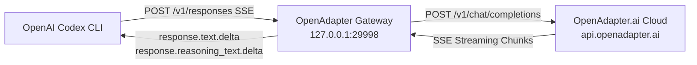

# ⚡ OpenAdapter for Codex

> **Run OpenAdapter.ai models inside OpenAI Codex CLI with zero setup.**  
> Seamless `/v1/responses` SSE wire protocol translation, reasoning token streaming, and automatic Codex configuration.

[](LICENSE)
[](https://nodejs.org)
[](https://openadapter.ai)
[](https://openadapter.ai)
[-FF5722?style=for-the-badge&logo=openai&logoColor=white)](https://dashboard.openadapter.in/?ref=BDPBCR3R)

> [!TIP]
> ### 🎁 Exclusive Community Promo: 20% OFF OpenAdapter Coding Plans!
> OpenAdapter delivers 40+ top-tier open-source coding & reasoning models (*DeepSeek-R1, DeepSeek-V3, Qwen2.5-Coder, GLM-5.2, Kimi-K2.5, MiniMax-M3, Mistral-Large*) starting at just **$6.99/month** (4x cheaper than proprietary tools).  
> 👉 **[Claim 20% OFF with Invite Link `https://dashboard.openadapter.in/?ref=BDPBCR3R`](https://dashboard.openadapter.in/?ref=BDPBCR3R)** *(Referral Code: `BDPBCR3R`)*

---

## 🌟 Key Highlights

- **⚡ Zero Configuration**: 1-line installer automatically registers `[model_providers.OpenAdapter]` in `~/.codex/config.toml`.
- **🔄 Full Responses API Protocol**: Intercepts Codex CLI's internal `/v1/responses` SSE stream and maps it to OpenAdapter's chat completions.
- **🧠 Native Reasoning Stream**: Full support for `<think>` reasoning deltas (DeepSeek-R1, Kimi-K2-Think, 0G-DeepSeek-v4-Pro, GLM-5).
- **🪶 Ultra-Lightweight**: Built with pure native Node.js stdlib (Zero npm runtime dependencies, ~15MB RAM footprint).
- **🛠️ Cross-Platform**: Runs on Linux (systemd / background daemon), macOS (launchd / background), and Windows WSL.

---

## 🚀 Quick Start (1-Line Install)

Run the installer in your terminal (Linux, macOS, or Windows WSL):

```bash
curl -fsSL https://raw.githubusercontent.com/romangalaxys10-spec/openadapter-for-codex/main/install.sh | bash
```

### Or Manual Setup

```bash
# 1. Clone repository
git clone https://github.com/romangalaxys10-spec/openadapter-for-codex.git ~/.openadapter-codex/app

# 2. Run setup wizard
~/.openadapter-codex/app/bin/cli.js setup

# 3. Launch Codex CLI
codex
```

---

## 🏗️ Architecture



---

## 💻 CLI Commands

Manage the OpenAdapter gateway easily with the included CLI:

| Command | Description |
| :--- | :--- |
| `openadapter-codex setup` | Interactive setup wizard (sets API key, model, port) |
| `openadapter-codex start` | Start the gateway in the background |
| `openadapter-codex stop` | Stop the background gateway |
| `openadapter-codex status` | Check gateway health, listening port, and API key |
| `openadapter-codex set-key <KEY>` | Update your OpenAdapter API key (`sk-oa-...`) |
| `openadapter-codex set-model <NAME>` | Change default model (e.g. `oa-robin-mini-preview`) |
| `openadapter-codex test` | Run local self-test and connectivity check |

---

## 🤖 Verified OpenAdapter Models Catalog

OpenAdapter offers 40+ SOTA open-source and reasoning models (from [**openadapter.dev/#models**](https://openadapter.dev/#models) and [**dashboard.openadapter.in/models**](https://dashboard.openadapter.in/models)):

| Family | Supported Models |
| :--- | :--- |
| **DeepSeek** | `DeepSeek-V3`, `DeepSeek-R1`, `0G-DeepSeek-V3`, `0G-DeepSeek-v4-Pro`, `0G-DeepSeek-v4-Flash`, `deepseek-ai/deepseek-coder-6.7b-instruct` |
| **Qwen** | `Qwen2.5-Coder`, `Qwen3-Coder`, `0G-Qwen3.7-max`, `0G-Qwen3.6`, `Qwen3.5-Plus`, `Qwen3-32B`, `0G-Qwen-VL`, `Qwen3.5-VL` |
| **GLM (Zhipu)** | `GLM-5.2`, `GLM-5.1`, `GLM-5`, `0G-GLM-5.2`, `0G-GLM-5.1`, `0G-GLM-5`, `GLM-5-Turbo`, `GLM-4.7`, `GLM-4.6`, `GLM-Air` |
| **Kimi (Moonshot)** | `Kimi-K2.5`, `Kimi-K2-Think`, `moonshotai/kimi-k2.6`, `Kimi-K2` |
| **MiniMax** | `MiniMax-M3`, `0g-minimax-m3`, `MiniMax-M2.7`, `MiniMax-M2.5`, `MiniMax-M2.1` |
| **Mistral** | `Mistral-Large`, `Mistral-Medium`, `Mistral-Small`, `free/dolphin-mistral-24b-venice-edition` |
| **Meta Llama** | `Llama-4-Maverick`, `Llama-4-Scout`, `Llama-3.3-70B`, `Llama-3.1-405B`, `meta/codellama-70b` |
| **Gemma & Hermes** | `Gemma-3-27B`, `Gemma-3-12B`, `Hermes-4-405B`, `Hermes-4-14B`, `OA-Robin-Mini-Preview` |
| **Free Tier** | `free/north-mini-code`, `free/gemma-4-31b-it`, `free/gpt-oss-20b`, `free/nemotron-3-nano-omni-30b-a3b-reasoning`, `free/nemotron-3-super-120b-a12b` |

Switch models anytime inside Codex CLI with `/model` or via CLI:
```bash
openadapter-codex set-model DeepSeek-V3
# or
openadapter-codex set-model Qwen2.5-Coder
# or
openadapter-codex set-model GLM-5.2
```

---

## ⚙️ Codex Configuration (`~/.codex/config.toml`)

The installer automatically configures your `~/.codex/config.toml`:

```toml
model_provider = "OpenAdapter"
model = "oa-robin-mini-preview"

[model_providers.OpenAdapter]
name = "OpenAdapter"
base_url = "http://127.0.0.1:29998/v1"
wire_api = "responses"
requires_openai_auth = false
```

---

## 📄 License

MIT License. Designed and maintained for the [OpenAdapter.ai](https://openadapter.ai) community.
